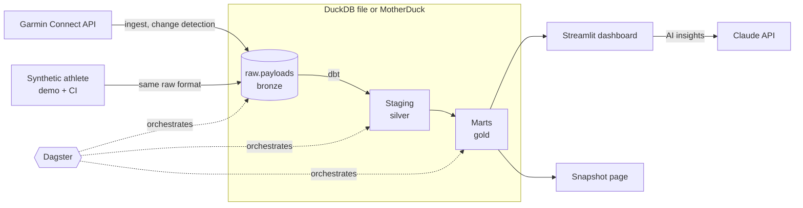

# garmin_project

A personal data platform for training data: it ingests my Garmin Connect data
into DuckDB, models it with dbt, orchestrates it with Dagster, and serves it in a
Streamlit dashboard with AI coaching and a static snapshot page. It runs locally
on a DuckDB file, or against MotherDuck with one setting.

It is a real, daily-used pipeline, built the way I would build one at work:
raw data kept as an append-only, replayable bronze layer, every transformation
in tested dbt models, and CI that runs the whole pipeline on synthetic data.


*The running calendar, here on the synthetic demo athlete. Circle area follows distance; a ring marks a hard run (half or more of the time in heart rate zone 3+); a red dot marks a low-recovery morning; the right column holds weekly totals, orange when more than 10% up.*

## Architecture



| Layer | What it is |
|---|---|
| **Ingest** | One pluggable `Source` per system. The Garmin source makes one record per API call and keeps the payload untouched. A source only fetches data; it never transforms it. |
| **Bronze** | Append-only `raw.payloads` table (payload and params as JSON, plus load metadata) and a `raw.loads` run log, in the same database as the models. A record is only stored when it is new or changed; a load and its run-log row commit in one transaction. Every model can be rebuilt from this table. |
| **Silver, gold** | dbt on DuckDB. Staging keeps the newest version per day. Marts cover daily health, activities, body composition, race results with personal bests, and Garmin's race predictions. Every model has data tests, plus a dbt unit test for race detection. |
| **Orchestration** | Dagster: raw ingest as daily partitions (backfill or rerun any day), each dbt model as an asset with its tests as checks, and freshness checks. |
| **Serving** | Streamlit, reading marts only. It covers overview, activities, a running calendar, recovery, body, races, rule-based insights, and AI coaching through the Claude API: a goal-based coach, trend reads and an explanation of the race predictions. `uv run snapshot` renders the marts as one self-contained HTML page for static hosting. |

## Engineering choices worth a look

- **An append-only raw layer.** Change detection compares each payload with the latest stored version of the same source, endpoint and params, so overlapping re-fetches store nothing new while real changes are kept as history. Records and their run-log row commit together ([storage.py](src/garminreader/ingest/storage.py)).
- **A synthetic athlete in the exact API format.** It simulates a year of training: fitness and fatigue loads, VO2 max, race times from Daniels' VDOT formulas, an illness, and two half marathons. It writes raw Garmin-shaped records, so the real loader, every dbt model and the dashboard run on it unchanged. A contract test fails if the real source gains an endpoint the generator does not cover ([synthetic/](src/garminreader/synthetic/)).
- **Real and demo data kept apart.** `DATA_PROFILE=prod|demo`. Demo locations read `DEMO_*` settings only, real ingest refuses to run in demo, and the demo dashboard disables Garmin refresh. The public demo can never contain personal data.
- **No infrastructure to run.** Everything lives in one DuckDB database: a local file, or MotherDuck when `DATABASE=md:<name>`. The daily run is `uv run pipeline` from any scheduler; a GitHub Actions workflow runs it every morning without ever logging in to Garmin with a password ([Scheduled refresh](#scheduled-refresh)).

## Run it

You need Python 3.12+ and [uv](https://docs.astral.sh/uv/).

**Demo, no Garmin account needed:**

```sh
uv sync
export DATA_PROFILE=demo
uv run synthesize        # a simulated year of a runner, as raw Garmin responses
uv run transform         # dbt build: models and tests
uv run dashboard
```

**Your own Garmin data:**

```sh
cp .env.example .env     # set GARMIN_EMAIL, GARMIN_PASSWORD; optionally DATABASE=md:garmin and MOTHERDUCK_TOKEN
uv run ingest garmin --since 2026-01-01   # asks for an MFA code once, then caches the session
uv run transform
uv run dashboard
```

**Through Dagster:** `uv run pipeline` runs ingest, dbt build and the checks in process. `uv run dagster dev` opens the UI for lineage, partitions and backfills.

Without `--since`, ingest resumes from the last load minus one day, because Garmin keeps updating recent days after late watch syncs.

### Scheduled refresh

[`.github/workflows/refresh.yml`](.github/workflows/refresh.yml) runs `uv run pipeline` against MotherDuck every morning (04:17 UTC, about 06:00 in Amsterdam) and can be started by hand from the Actions tab, optionally for one day. Each run ingests that day and the day before: about 18 calls to Garmin.

It never logs in with a password. A password login from a cloud runner is what makes Garmin ask for MFA, show a captcha or lock the account, so the run only resumes a session you created on your own machine, and fails clearly (with an email from GitHub) when that session stops working.

One-time setup, from a clone with your `.env`:

```sh
uv run garmin-tokens login                                  # password and MFA code, on your machine
uv run garmin-tokens export | gh secret set GARMIN_TOKENS   # the session, as a repository secret
gh secret set MOTHERDUCK_TOKEN                              # paste the MotherDuck token
gh secret set SECRETS_TOKEN                                 # paste a fine-grained token, see below
```

`SECRETS_TOKEN` is a [fine-grained personal access token](https://github.com/settings/personal-access-tokens) for this repository only, with the permission *Secrets: Read and write*. Garmin can hand out a new refresh token when the session refreshes; the workflow then writes the new session back to `GARMIN_TOKENS` so the next run still works. Without this token a refreshed session is not saved and the run fails with an error saying so.

When the run fails with "No working Garmin session": run the two `garmin-tokens` commands above again. Expect that about once a year, or after a password change.

If Garmin starts refusing GitHub's IP addresses, run the same workflow on a machine at home: [add a self-hosted runner](https://docs.github.com/en/actions/hosting-your-own-runners/managing-self-hosted-runners/adding-self-hosted-runners) (it needs uv and the GitHub CLI) and set the repository variable `REFRESH_RUNNER` to `self-hosted`. GitHub keeps scheduling, logging and alerting; only the Garmin calls come from your own connection.

## Quality

```sh
uv run ruff check . && uv run ruff format --check . && uv run mypy && uv run pytest
```

- **Python:** fully typed (`mypy --strict`). Tests cover the raw store's guarantees, the Garmin source (retries, 404s, windows), the synthetic contract, the Dagster definitions, the dashboard queries and the AI prompt building.
- **CI on every pull request:** the checks above, and the pipeline end to end on synthetic data.

## Layout

```
src/garminreader/
  ingest/          sources (Garmin), the raw store, the ingest CLI
  synthetic/       the simulated athlete and its Garmin-shaped payloads
  orchestration/   Dagster assets, checks, schedule, the pipeline CLI
  dashboard/       Streamlit app; queries.py is its only database access
  snapshot/        static HTML page of the marts
  config.py        every setting, from .env
  db.py            connections to the local file or MotherDuck
transform/         dbt project: staging/ and marts/
.github/workflows/ CI
```

## Stack

Python 3.12 · uv · python-garminconnect · DuckDB / MotherDuck · dbt-duckdb · Dagster with dagster-dbt · Streamlit · Plotly · Claude API · GitHub Actions

## Roadmap

- TrainMore gym visits (check-in and check-out) as a second source, combined with Garmin recovery and training load.
- Possibly Strava, including matching activities seen by both Garmin and Strava.

## Notes

This project uses the unofficial [python-garminconnect](https://github.com/cyberjunky/python-garminconnect) library and is not affiliated with Garmin. The training suggestions and AI insights come from data patterns and are not medical or coaching advice.
