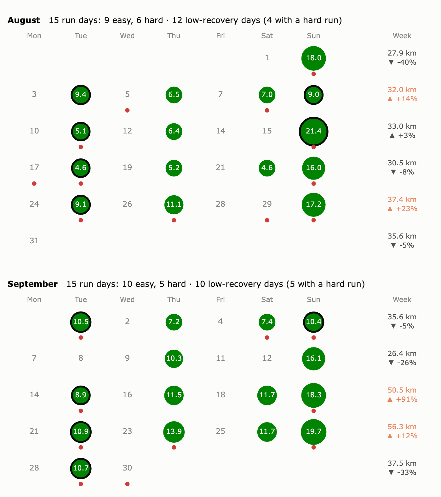
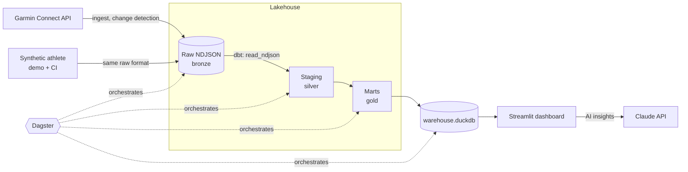

# garmin_project

A personal data platform for training data: it ingests my Garmin Connect data
into a small lakehouse, models it with dbt, orchestrates it with Dagster, and
serves it in a Streamlit dashboard with AI coaching. It runs locally with one
command, and deploys to Azure with Terraform and GitHub Actions.

It is a real, daily-used pipeline, built the way I would build one at work:
raw data kept as an immutable, replayable bronze layer, every transformation
in tested dbt models, infrastructure as code with least-privilege identities,
and CI that runs the whole pipeline on synthetic data.



*The running calendar, here on the synthetic demo athlete. Circle area follows distance; a ring marks a hard run (half or more of the time in heart rate zone 3+); a red dot marks a low-recovery morning; the right column holds weekly totals, orange when more than 10% up.*

## Architecture



| Layer | What it is |
|---|---|
| **Ingest** | One pluggable `Source` per system. The Garmin source makes one record per API call and keeps the payload untouched. A source only fetches data; it never transforms it. |
| **Bronze** | Append-only NDJSON under `<source>/endpoint=/load_date=/`, on local disk or Azure Data Lake Storage. A record is only stored when it is new or changed, and a load becomes visible only once its commit marker exists (all or nothing). The whole warehouse can be rebuilt from these files. |
| **Silver, gold** | dbt on DuckDB reads the raw files directly. Staging keeps the newest version per day. Marts cover daily health, activities, body composition, race results with personal bests, and Garmin's race predictions. Every model has data tests, plus a dbt unit test for race detection. |
| **Orchestration** | Dagster: raw ingest as daily partitions (backfill or rerun any day), each dbt model as an asset with its tests as checks, freshness checks, and a publish step. |
| **Serving** | Streamlit, reading marts only. It covers overview, activities, a running calendar, recovery, body, races, rule-based insights, and AI coaching through the Claude API: a goal-based coach, trend reads and an explanation of the race predictions. |

## Engineering choices worth a look

- **A replayable raw layer instead of a mutable table.** Change detection compares each payload with the latest stored version. A small index keeps that fast, and it can always be rebuilt from the committed files. A crash between writing data and writing the marker leaves files that dbt ignores ([storage.py](src/garminreader/ingest/storage.py)).
- **A synthetic athlete in the exact API format.** It simulates a year of training: fitness and fatigue loads, VO2 max, race times from Daniels' VDOT formulas, an illness, and two half marathons. It writes raw Garmin-shaped records, so the real loader, every dbt model and the dashboard run on it unchanged. A contract test fails if the real source gains an endpoint the generator does not cover ([synthetic/](src/garminreader/synthetic/)).
- **Real and demo data kept apart.** `DATA_PROFILE=prod|demo`. Demo locations read `DEMO_*` settings only, real ingest refuses to run in demo, and the demo dashboard disables Garmin refresh. The public demo can never contain personal data.
- **Infrastructure for two environments from one module.** `demo` is public with synthetic data; `prod` is private behind Entra ID. Every workload has its own managed identity, scoped to single storage containers and single secrets. There are no keys anywhere: storage keys are off, and CI uses OIDC. Secret values never enter Terraform state. The CI deploy identity may only assign the five workload roles, enforced by an ABAC condition.
- **Trade-offs written down.** Private networking would cost about €50 a month more than the rest of the stack. It is skipped deliberately, documented inline for checkov, and given an upgrade path in [infra/README.md](infra/README.md).

## Run it

You need Python 3.12+ and [uv](https://docs.astral.sh/uv/).

**Demo, no Garmin account needed:**

```sh
uv sync
export DATA_PROFILE=demo
uv run synthesize        # a simulated year of a runner, as raw Garmin responses
uv run transform         # dbt build: models and tests
uv run dashboard
```

**Your own Garmin data:**

```sh
cp .env.example .env     # set GARMIN_EMAIL, GARMIN_PASSWORD, optionally ANTHROPIC_API_KEY
uv run ingest garmin --since 2026-01-01   # asks for an MFA code once, then caches the session
uv run transform
uv run dashboard
```

**Through Dagster:** `uv run pipeline` runs ingest, dbt build, the checks and publishing in process. `uv run dagster dev` opens the UI for lineage, partitions and backfills.

Without `--since`, ingest resumes from the last load minus one day, because Garmin keeps updating recent days after late watch syncs.

## Quality

```sh
uv run ruff check . && uv run ruff format --check . && uv run mypy && uv run pytest
```

- **Python:** fully typed (`mypy --strict`). Tests cover the raw store's guarantees, the Garmin source (retries, 404s, windows), the synthetic contract, the Dagster definitions, the dashboard queries and the AI prompt building.
- **CI on every pull request:** the checks above; the pipeline end to end on synthetic data; a Docker image build that runs the pipeline inside the image and is scanned with Trivy. Terraform changes also get `fmt`, `validate`, tflint, checkov, and a plan per environment posted on the pull request.
- **Deploy on merge:** build, scan and push the image, apply `demo`, run the pipeline, smoke-test the dashboard. `prod` follows after approval.

## Layout

```
src/garminreader/
  ingest/          sources (Garmin), the raw store, the ingest CLI
  synthetic/       the simulated athlete and its Garmin-shaped payloads
  orchestration/   Dagster assets, checks, schedule, the pipeline CLI
  dashboard/       Streamlit app; queries.py is its only database access
  config.py        every setting, from .env
transform/         dbt project: staging/ and marts/
infra/             Terraform for Azure: bootstrap, modules, envs/demo and envs/prod
.github/workflows/ CI, Terraform plan, deploy
```

## Stack

Python 3.12 · uv · python-garminconnect · DuckDB · dbt-duckdb · Dagster with dagster-dbt · fsspec/adlfs · Streamlit · Plotly · Claude API · Docker · Terraform (azurerm, azapi, azuread) · Azure Container Apps, Data Lake Storage, Key Vault, Log Analytics · GitHub Actions

## Roadmap

- TrainMore gym visits (check-in and check-out) as a second source, combined with Garmin recovery and training load.
- Possibly Strava, including matching activities seen by both Garmin and Strava.

## Notes

This project uses the unofficial [python-garminconnect](https://github.com/cyberjunky/python-garminconnect) library and is not affiliated with Garmin. The training suggestions and AI insights come from data patterns and are not medical or coaching advice.
